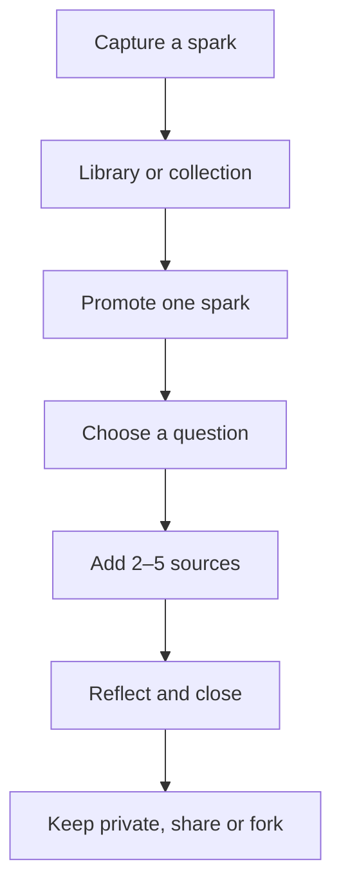
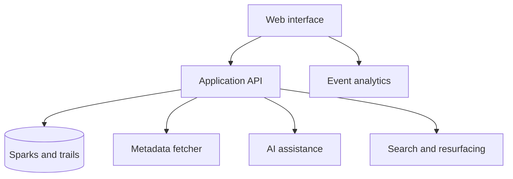
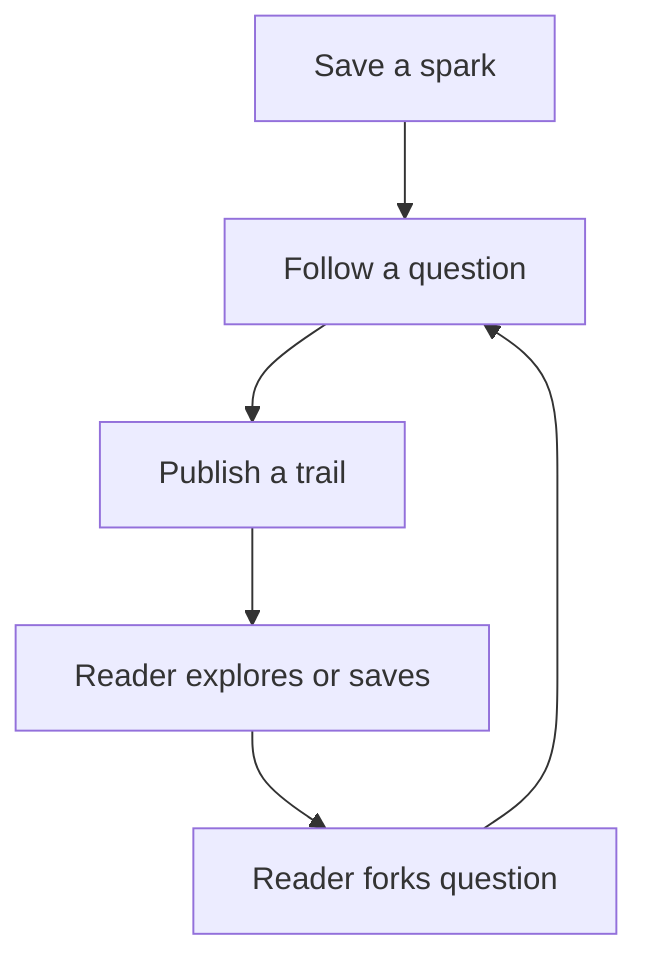

# Curiosity Engine — Revised Product and Build Plan

Prepared for Rachel Wong · August 2026  
Revised after product research into [Sublime](https://sublime.app/)

## 1. Executive summary

Curiosity Engine is a calm home for the things that make a person curious—and a guided way to do something with them. It combines a lightweight **Spark Library** for saving clips, articles, images, notes and passing interests with structured **Question Trails** that help a person choose one question, gather several perspectives, record how their understanding changes and publish or privately keep what they learned.

Research into Sublime materially improves the original concept. Sublime demonstrates that capture can feel expressive rather than administrative: everything becomes a card, cards can belong to multiple collections, natural-language retrieval reduces filing pressure, related ideas create serendipity, and public libraries can feel social without likes or comments. Its current product also exposes the strategic opportunity for Curiosity Engine. Sublime is strongest at **collecting, retrieving and connecting inspiration**; Curiosity Engine should specialise in **turning selected inspiration into a finite act of inquiry and synthesis**.

The revised product therefore has two connected layers:

1. **Spark Library:** capture, annotate, loosely collect, retrieve and gently resurface inspiration.
2. **Question Trails:** promote one spark or collection into an active question, pursue two to five sources, compare perspectives and close with a user-written synthesis.

This distinction matters. The product should feel generous toward collecting, but it must not mistake a growing archive for learning. The central success event remains a completed, evidence-linked reflection—not the number of cards saved.

This project should connect directly to Rachel's Sidequest Substack and the first edition, “How do you become curious again?” The product itself can be distributed through the content, while the content becomes an authentic source of research participants and question trails. The strongest portfolio story is not that an AI summarises articles; it is that the product changes a passive saving behaviour into active inquiry and can measure that conversion.

### Portfolio signals

- Consumer discovery and behaviour design.
- Product positioning and differentiation.
- Information architecture and interaction design.
- Responsible use of AI recommendations and synthesis.
- Evaluation of model quality and provenance.
- Activation, retention and creator-led growth.
- Analytics, experiments and evidence-led iteration.
- Competitive product analysis and deliberate feature scoping.
- Recommendation and retrieval design without an engagement-maximising feed.

### One-line portfolio story

> I studied how people collect inspiration, analysed Sublime and adjacent knowledge tools, then built a product that connects a flexible inspiration library to finite question trails. I launched it through Sidequest and measured whether people progressed from passive saving to evidence-linked reflection.

### Recommended duration

Eight weeks at 8–12 focused hours per week, followed by a four-week retention and content-distribution observation period. The first release remains intentionally smaller than Sublime: web first, URL/text capture, lightweight collections and question trails. Browser extensions, mobile capture, communal recommendations and a visual canvas belong to later validation stages.

---

## 2. Product strategy

### Product vision

Make curiosity easier to act on by helping people stay with a question long enough for it to lead somewhere unexpected.

### Initial target user

Curious university students, recent graduates and early-career knowledge workers who:

- Save articles, videos, posts or podcast links several times per week.
- Rarely return to most saved material.
- Want to understand ideas rather than only consume summaries.
- Occasionally write, discuss or share what they learn.
- Are comfortable using a browser-based tool.

Do not target formal academic literature review, classroom learning management, enterprise knowledge bases or exam revision in the MVP.

### Core job to be done

> When something catches my interest, help me turn that spark into a question I can actually pursue, so I finish with a clearer view rather than another forgotten bookmark.

### Problem hypothesis

The friction is not a lack of information. People accumulate saved content faster than they can process it. Existing read-later and note tools optimise capture and storage, but provide weak support for choosing what to pursue, connecting multiple sources and deciding when an inquiry is complete.

### Product hypothesis

> If a saved item is converted into a user-owned question with a small, visible path to completion, users will start and complete more meaningful learning sessions than when content remains in an undifferentiated saved list.

### Behavioural outcome

Move the user through this progression:

**Spark → question → source → reflection → changed understanding → share or next question.**

### Value proposition

**Stop collecting interesting things. Follow one question somewhere.**

### Differentiation

Curiosity Engine is not:

- A generic AI summary tool.
- A limitless bookmark manager.
- A social-media feed optimised for scrolling.
- A note-taking system that requires the user to design their own workflow.
- A chatbot that replaces reading.

The central object is the **question trail**, not the source, folder or conversation.

### Product principles

1. **The user owns the question.** AI may suggest wording but must not choose the inquiry.
2. **Sources remain visible.** Every summary or claim links back to its source.
3. **Finite beats endless.** A trail should have a small next action and a reachable stopping point.
4. **Reflection creates value.** The product asks what changed, not only what was consumed.
5. **Serendipity needs boundaries.** Recommendations should widen perspective without becoming an infinite feed.
6. **Depth is not volume.** More sources do not automatically mean more learning.
7. **Capture now, organise lightly.** A useful spark should not be lost because the user cannot immediately decide where it belongs.
8. **An archive should lead back to action.** Retrieval and resurfacing should offer a deliberate next step, not another feed.

### Product model

| Layer | Core object | User question | Product responsibility |
|---|---|---|---|
| Capture | Spark | “Why did this catch my attention?” | Preserve the link or thought with minimal friction and one line of personal context |
| Organise | Collection | “What interest or intention could this belong to?” | Allow loose, overlapping groupings without demanding a taxonomy |
| Retrieve | Search/resurfacing | “Where was that thing?” or “What should I revisit?” | Find by remembered meaning and bring back a bounded number of relevant sparks |
| Investigate | Question Trail | “What do I want to understand?” | Provide a finite inquiry structure, visible sources and perspective prompts |
| Synthesise | Reflection | “What changed, and what remains uncertain?” | Preserve the user's reasoning and distinguish it from AI assistance |
| Share | Public trail | “What path could another person learn from or continue?” | Publish a quiet, source-linked artifact that can be explored or forked |

The technical complexity of traditional PKM terminology should be avoided in the interface. Users do not need to learn backlinks, graph theory, PARA, Zettelkasten or a proprietary tagging system to receive value.

### Sidequest product-language system

Curiosity Engine can share language with Sidequest without requiring readers to know the newsletter:

| Sidequest element | Curiosity Engine equivalent |
|---|---|
| Curiosity Cabinet / Collected | Spark Library or a themed collection |
| The Inquiry | Active Question Trail |
| Field Notes | Source annotations and reflection |
| Try This | Prompt to fork or pursue a related question |
| Opening question | Public trail title |

Use this language selectively. “Spark,” “collection,” “question trail” and “reflection” are sufficiently clear for general users; newsletter-specific language should add personality, not confusion.

### Sublime product teardown — August 2026

#### What Sublime is doing

Sublime positions itself as a personal knowledge tool for creative people rather than a productivity database. Its product centres on a few connected ideas:

- Everything saved becomes a **card**. Cards can represent highlights, links, articles, images, audio, video, PDFs, books or standalone text.
- Cards can belong to **multiple collections**, and saving does not require the user to choose a collection immediately.
- Capture happens through the web app, iOS app and browser extension; paid integrations include Kindle, Readwise, X, Instagram and Raycast.
- **Related cards** connect a saved item with relevant material from the user's library and other people's public libraries.
- **Natural-language search**, embeddings and OCR help users retrieve something from context, feeling or partial memory rather than exact keywords.
- **Canvas** provides a spatial workspace for arranging and remixing saved ideas.
- Libraries and collections can be private or public. The public layer deliberately omits likes and comments.
- Users can export their material and bring collection context into Claude or other language models.

These are documented across Sublime's [product site](https://sublime.app/), [founder's product explanation](https://sublimeinternet.substack.com/p/what-does-sublime-actually-do), [comparison with Are.na](https://sublime.app/compare/arena), [Chrome extension listing](https://chromewebstore.google.com/detail/sublime/fnliebffpgomomjeflboommgbdnjadbh) and [pricing page](https://sublime.app/pricing).

#### Why the experience resonates

Sublime gets several emotional and behavioural details right:

1. **Low filing anxiety.** Capture is allowed before categorisation, and one card can live in several collections.
2. **Collections express intention.** They can represent a question, emerging idea or point of view rather than a rigid folder hierarchy.
3. **Human curation supplies taste.** Related ideas are not presented as generic web results; they inherit value from what another person chose to save.
4. **Retrieval matches memory.** Semantic search addresses the common experience of remembering a feeling or fragment but not the exact title.
5. **The social layer is quiet.** Public libraries create ambient discovery without likes, comments or pressure to perform.
6. **The interface supports identity.** A library becomes an expression of what the user notices, not only a utility database.
7. **Creation is the stated destination.** Canvas, exports and AI context attempt to bridge the gap between collecting and making.

Public feedback supports this appeal. [App Store reviewers](https://apps.apple.com/us/app/sublime-internet/id6449081538) particularly value the balance of saving, discovery, re-engagement and calm community, while [Reddit discussions](https://www.reddit.com/r/PKMS/comments/1e08d3z/sublime_a_pkm_tool_for_people_who_hate_pkm_tools/) repeatedly describe the product as a tasteful or soulful alternative to high-maintenance PKM systems. In a [public launch post](https://www.reddit.com/r/PKMS/comments/1jw82w8/a_multiplayer_pkm_designed_for_creativity_sublime/), Sublime reported more than 11,000 users and 1,500 paying members; treat those founder-reported figures as directional evidence of willingness to pay, not independent validation.

#### Tensions and unmet needs

Sublime also reveals useful product risks:

- **Saving can still become the end state.** “Save one, discover 100 more” is compelling, but it may increase exploration without creating a moment of synthesis.
- **Serendipity can become another consumption loop.** Related cards need boundaries if the desired outcome is understanding rather than browsing.
- **The communal layer is not universally valuable.** Some users do not want raw personal saves to be public and do not find other people's unprocessed material useful.
- **Privacy must feel foundational.** One [App Store reviewer](https://apps.apple.com/us/app/sublime-internet/id6449081538) objected to private-collection restrictions in the free tier; regardless of pricing strategy, Curiosity Engine should not make basic privacy feel like an upsell.
- **Pricing can block habit formation.** Users may not understand the value before they have built enough of a library to experience retrieval and connection.
- **A broad creative library has a weak completion signal.** It is difficult to tell whether a person has moved from inspiration to a more developed view.
- **Complex research workflows remain out of scope.** Sublime itself acknowledges that its opinionated simplicity is not intended for every advanced PKM need.
- **The first-use value can be delayed.** Reviews suggest the product becomes intuitive once users “get the lay of the land,” but an empty library and related-card cold start can obscure the magic.

These tensions define Curiosity Engine's opportunity: preserve the calm, associative library while adding a clear transition from **interesting** to **investigated**.

### What Curiosity Engine should borrow, adapt or reject

| Sublime pattern | Decision for Curiosity Engine | Timing | Reason |
|---|---|---|---|
| Universal card object | **Adapt as Spark** | MVP | Gives links and notes one consistent representation while using distinctive product language |
| Capture before categorisation | **Include** | MVP | Minimises filing friction; “why this interested me” is more valuable than mandatory tags |
| One card in multiple collections | **Include** | MVP | Interests overlap; collections should represent intentions, not exclusive folders |
| Notes attached to saved items | **Include** | MVP | Preserves the user's original reason for saving and supports later question formation |
| Private/public controls | **Include; private by default** | MVP | Trust requirement, not a premium convenience |
| Public collections | **Defer** | Phase 2 | Public question trails have a clearer purpose and lower privacy ambiguity |
| Related cards from own library | **Adapt as Related Sparks** | Post-MVP experiment | Useful for connecting prior interests; start with a maximum of three results |
| Related cards from community | **Defer** | Phase 3 | Requires network density, moderation, privacy rules and recommendation evaluation |
| Natural-language search | **Progressive enhancement** | Keyword search in MVP; semantic in Phase 2 | Valuable at scale but unnecessary before users have enough cards |
| OCR across screenshots/images | **Defer** | Phase 2/3 | Strong retrieval benefit but creates cost, privacy and implementation complexity |
| Browser extension | **Defer until capture friction is proven** | Phase 2 | Useful but high scope for a beginner; pasted URLs test the core behaviour first |
| Kindle/Readwise/social imports | **Reject for MVP** | Phase 3 | Integration work does not test the question-trail hypothesis |
| Infinite visual Canvas | **Replace with structured trail board** | MVP | A bounded workspace better supports inquiry and is much easier to build and test |
| AI insights and summaries | **Constrain** | MVP/Phase 2 | AI can reframe questions or surface perspective gaps, but user reflection remains the output |
| Export to LLMs | **Defer; provide Markdown export first** | Phase 2 | Data portability matters; direct model context can wait |
| No likes/comments | **Include** | MVP | Public artifacts should support exploration rather than status competition |
| “Save one, discover 100” | **Invert to “Save freely; pursue one”** | Product strategy | Protects the core promise and creates a measurable action |

### Revised positioning

**Category:** guided curiosity and personal inquiry.

**Not:** a full personal knowledge management system, academic research manager, read-later inbox or AI answer engine.

**Positioning statement:**

> For curious people whose saved ideas disappear into scattered apps, Curiosity Engine is a calm inspiration library that helps them choose one question and follow it into a finished, source-linked reflection. Unlike bookmark managers and second-brain tools, it measures value by what the user investigates and articulates—not by how much they collect.

**Short product line:**

> Save what sparks you. Follow what stays with you.

**Sharper action line:**

> Save freely. Pursue one.

---

## 3. Discovery and validation

### Research questions

1. What types of content do users save, where and why?
2. What percentage do they believe they revisit, and what triggers a return?
3. Is the real pain guilt, retrieval, prioritisation, lack of time or lack of purpose?
4. What makes a question compelling enough to pursue?
5. How do users currently know that they understand something better?
6. Do users want private reflection, public publishing or both?
7. When does guidance feel useful versus school-like or demanding?
8. Would importing content create copyright, privacy or trust concerns?
9. Do users want a durable inspiration library, a temporary inbox or both?
10. How do users currently group interests: topic, project, feeling, question or intended output?
11. At what point does serendipitous discovery become distracting consumption?
12. What would persuade a user to promote a saved item into an active question?
13. Does a user's own older material feel more valuable than recommendations from strangers?

### Recruitment plan

- Interview 12 target users.
- Include four heavy bookmark/read-later users.
- Include four people who write newsletters, essays or research notes.
- Include four who describe themselves as curious but inconsistent.
- Recruit at least half outside Rachel's close social circle.
- Recruit early beta users through Sidequest only after completing problem interviews.
- Include at least three users of Sublime, Readwise, Are.na, Raindrop, Notion or another PKM/read-later product.

### Interview guide

- Show me where you save interesting things.
- Choose one item you saved recently. What made you save it?
- What happened after you saved it?
- Tell me about the last topic you genuinely followed for several days.
- How did one source lead to the next?
- How do you decide what is worth returning to?
- What makes a learning tool feel energising or burdensome?
- Have summaries ever made you feel informed without really understanding?
- When do you share or publish what you learn?
- If you could rescue one saved item from your backlog, which would it be and why?
- When you create a folder, collection or board, what are you hoping it will help you do?
- Show me the last time an old save helped you create, decide or understand something.
- Would seeing related material help you pursue this interest, or tempt you to keep browsing?

Observe the real save locations with consent. Do not rely only on what participants say they do.

### Diary study

Ask six participants to record, for seven days:

- What they saved.
- Why they saved it.
- Whether they revisited it.
- What question, if any, it created.
- What prevented a next step.

Keep the diary prompt under one minute per item to avoid turning the study into the intervention.

### Concierge prototype

Before building AI features, manually help five users create a trail:

1. Choose one saved item.
2. Turn interest into a question.
3. Select two additional perspectives.
4. Record what changed.
5. Decide whether to close, continue or publish.

This tests the workflow independently of model quality.

### Comparative product test

Run a lightweight comparative test with four participants. Do not ask whether they “like” Sublime or Curiosity Engine. Give each participant equivalent tasks in an accessible competitor and the clickable Curiosity Engine prototype:

1. Save an interesting article and explain why it matters.
2. Place it in two overlapping areas of interest.
3. Find an older item using an imperfect memory cue.
4. Decide what to explore next.
5. Turn one saved item into a question and explain when the task feels complete.

Observe time, comprehension, emotional response and the user's expected next step. Curiosity Engine does not need to beat Sublime on capture breadth; it should make the transition to intentional investigation noticeably clearer.

### Evidence threshold

Proceed if:

- At least eight of 12 participants have a repeated save-without-return pattern.
- At least six describe prioritisation or lack of a next step as part of the problem.
- At least four of five concierge users complete a trail and say the question structure changed how they engaged with the sources.
- Four of five prototype users can distinguish a “trail” from a folder or reading list.
- At least three of four comparative-test users understand how a spark becomes a trail without explanation.
- At least half of interviewees value keeping a lightweight library in the same product; otherwise keep capture deliberately temporary and focus the product on trails.

If guilt reduction is the dominant need but users do not want to pursue questions, revise the proposition rather than forcing the original concept.

### Research outputs

- Current save-and-forget journey.
- Behavioural segments based on intent, not demographics.
- Opportunity-solution tree.
- Question-trail prototype findings.
- Language bank using participants' wording.
- Assumptions ranked by risk and evidence.
- A clear statement of what Sidequest readers do and do not represent.

---

## 4. MVP and scope

### MVP outcome

A user adds a link or short note to a lightweight Spark Library, optionally places it in one or more collections, later turns it into a question, builds a trail using two to five sources, records how their view changed and privately saves or publicly shares a readable trail.

The MVP must prove two connected behaviours:

1. **Return value:** a saved spark can be found or resurfaced with enough context to become useful again.
2. **Inquiry value:** a user can promote that spark into a question and finish a meaningful reflection.

The product does not need to prove universal capture, a mature second brain or network-based discovery in its first release.

### Must-have capabilities

#### 4.1 Capture a spark

- Paste a URL or write a passing interest.
- Fetch only permitted metadata: title, source, image and description where available.
- Let the user add why it caught their attention.
- Save immediately without forcing a collection.
- Preserve the original link.
- Clearly handle unsupported or inaccessible content.

#### 4.2 Build a lightweight Spark Library

- Display saved material as consistent cards with title, source type, preview, date and the user's “why it sparked me” note.
- Support URL and standalone text cards in the MVP.
- Allow a card to belong to zero, one or several collections.
- Let users create, rename and archive collections.
- Offer simple keyword search across title, source and user note.
- Provide list/grid choice only if user testing shows a need; otherwise choose one calm default.
- Show a bounded “Revisit one spark” prompt rather than an endless resurfacing feed.
- Make “Start a question trail” the prominent action on every card.

Collections should be framed as evolving interests or intentions—for example “What makes cities feel alive?” or “Physical AI”—rather than requiring generic taxonomic folders such as “Technology.” The system may suggest a clearer collection name later, but the MVP should not auto-file cards.

#### 4.3 Shape a question

- User writes the initial question.
- Offer two or three AI-assisted reframings as optional prompts.
- Let the user choose, edit or reject every suggestion.
- Encourage open questions rather than a topic label.
- Capture what the user currently thinks or assumes.
- Allow the question to begin from one spark, several selected sparks or an entire collection.

#### 4.4 Create a trail

- Add sources by URL or manual citation.
- Attach a short personal note to each source.
- Show a finite progress path such as three source slots plus reflection.
- Reorder or remove sources.
- Indicate source type and viewpoint.
- Preserve provenance for any machine-generated note.
- Let a user reuse an existing spark as a source without duplicating it.
- Show a structured board—Starting Point, Perspectives, Reflection—rather than an unrestricted canvas.

#### 4.5 Reflect

- Prompt: “What changed in your understanding?”
- Prompt: “What are you less certain about now?”
- Compare starting assumption with final reflection.
- Let the user record a new question.
- Allow the user to mark the trail complete without claiming mastery.

#### 4.6 Save or publish

- Private by default.
- Public trail shows the question, source links, user-written notes and reflection.
- Provide a clean share card or link.
- Allow unpublishing.
- Make AI-assisted text distinguishable from user-written reflection.
- Allow a reader to save a public trail's source or fork its question without adding likes or comments.

### Optional MVP capability

1. **Perspective prompt:** After the user adds two sources, suggest a missing perspective category such as opposing view, primary source, data, historical context or lived experience. The system should suggest what to look for, not invent a source.
2. **Related Sparks:** Show up to three potentially related items from the user's own library when shaping a question. Treat this as an experiment, not a default feed.

### Explicit non-goals

- Browser extension in the first version.
- Native mobile app, share-sheet capture or background imports.
- Image upload, screenshot OCR and full PDF ingestion.
- Full article storage or paywall circumvention.
- Automatic completion of trails.
- Unlimited AI chat.
- Social follower feeds, likes or popularity ranking.
- Community-wide related-card recommendations.
- Infinite canvas or general-purpose mind mapping.
- Semantic search before library size and retrieval failures justify it.
- Academic citation management.
- Team workspaces.
- Automatic publishing to Substack.
- Gamified streaks that reward shallow activity.
- Claims that the product improves intelligence or mental health.

### Prioritisation

| Capability | User value | Learning value | Complexity | Decision |
|---|---:|---:|---:|---|
| Link/note capture | High | High | Low | MVP |
| Spark Library | High | High | Medium | MVP |
| Overlapping collections | Medium | High | Low | MVP |
| Keyword search | Medium | Medium | Low | MVP |
| Bounded resurfacing | Medium | High | Low | MVP experiment |
| User-owned question | High | High | Low | MVP |
| Finite trail builder | High | High | Medium | MVP |
| Starting and final reflection | High | High | Low | MVP |
| Public share page | Medium | High | Medium | MVP |
| AI question reframing | Medium | High | Medium | MVP with evaluation |
| Source perspective prompt | Medium | High | Medium | Optional MVP |
| Related Sparks from own library | Medium | High | Medium | Optional MVP / Phase 2 |
| Semantic search | Medium at scale | Medium | Medium | Phase 2 |
| Community recommendations | Unclear | Medium | Very high | Phase 3 |
| Browser extension | Medium | Low initially | High | Later |
| Canvas | Low for core hypothesis | Low | High | Exclude until evidence |
| Social feed | Unclear | Low | Very high | Exclude |

---

## 5. User experience

### Critical journey



The interface should support a second, faster entry path for people who already have a question: **New question → attach sparks later**. The library is useful infrastructure, not a gate.

### Required screens

1. **Landing page** — problem, interactive sample trail and clear difference from a bookmark manager or AI answer engine.
2. **Home** — one active question, one resurfaced spark and quick capture; do not lead with an unbounded feed.
3. **Capture modal/page** — URL or note plus optional “why this interested me.” Saving must take seconds.
4. **Spark Library** — searchable card view with simple filters for all, uncategorised and in a trail.
5. **Collection page** — title framed as an interest/intention, cards and “Turn this into a question.”
6. **Spark detail** — original source, personal note, collections, related personal sparks and trail action.
7. **Question shaping** — user draft, starting view and optional reframings.
8. **Trail workspace** — question, starting view, source cards and visible next step.
9. **Source detail** — original link, personal note and optional machine assistance.
10. **Reflection** — changed understanding, uncertainty and new question.
11. **Trail dashboard** — active, paused and completed trails.
12. **Public trail** — clean, source-linked reading view with save-source and fork-question actions.
13. **Settings** — privacy, AI controls, export and data deletion.

### Empty states

The first empty state should offer:

- Start from a link.
- Start from a question.
- Explore a complete sample trail.
- Import is deliberately absent; explain that paste capture keeps the beta focused.

Do not display an infinite gallery of topics that encourages passive browsing.

### Home-page hierarchy

The home page should answer three questions in order:

1. **What am I currently following?** Show one active trail and its next action.
2. **What might be worth returning to?** Show one bounded resurfaced spark with “Start a trail” or “Not now.”
3. **Where are all my other saves?** Link to the library and collections.

This hierarchy intentionally differs from a Pinterest-style grid. The product's visual richness lives in the library, while its behavioural priority lives on the home page.

### Spark states

| State | Meaning | Primary action |
|---|---|---|
| Inbox | Saved, no collection or trail | Add context, collect or pursue |
| Collected | Belongs to one or more interests | Revisit or start a trail |
| In a trail | Used as evidence in an active inquiry | Add a note or compare |
| Processed | Contributed to a completed trail | Revisit reflection or follow next question |
| Archived | Intentionally hidden from normal views | Restore or delete |

Avoid “unread” badges and backlog counts. They recreate completion anxiety and incorrectly imply that everything saved deserves consumption.

### Trail states

| State | Meaning | Primary action |
|---|---|---|
| Spark | Captured but not shaped | Turn into a question |
| Active | Question chosen, inquiry in progress | Add/read next source |
| Ready to reflect | Minimum source condition met | Record what changed |
| Completed | Reflection saved | Share or follow new question |
| Paused | User intentionally stops | Resume or archive |

Avoid labelling unfinished trails as failures.

### Visual direction

Borrow Sublime's sense of calm and delight, not its visual identity. The product should feel like a thoughtful editorial notebook rather than an enterprise dashboard:

- Generous whitespace and strong typography.
- Source cards with enough visual distinction to make mixed media feel alive.
- Warm neutral palette with one accent colour for active inquiry.
- Restrained motion when a spark is promoted into a trail.
- No dense sidebars, node graphs or dashboard chrome in the first release.
- Clear visible structure in trails so beauty does not obscure the next action.

### Content and copyright rules

- Store links and user-authored notes, not full copyrighted articles.
- Respect site access restrictions.
- Do not present a generated summary as a substitute for the original source.
- Quote sparingly and let the user verify text against the source.
- Clearly attribute title, publisher/creator and URL.
- Allow manual metadata correction.

### Accessibility

- Keyboard-accessible trail creation and reordering.
- Visible focus states.
- Semantic headings on public trails.
- Text alternatives for meaningful images.
- Do not use colour alone for source type or trail state.
- Ensure reflection fields work without timed pressure.

---

## 6. AI product design

### Appropriate AI jobs

AI may:

- Suggest alternative question wording.
- Identify whether a question is overly broad or closed.
- Suggest a missing perspective category.
- Retrieve potentially related sparks from the user's own library.
- Support natural-language search once the library is large enough to justify it.
- Draft a short source note when the source text is legally and technically available.
- Compare a user's starting statement with final reflection to highlight changes for confirmation.

AI must not:

- Decide the user's question.
- Invent sources, citations or claims.
- Mark a trail complete.
- Write a final reflection without explicit user input.
- Hide uncertainty behind fluent prose.
- Become the final authority on source credibility.
- turn the home page into an endless recommendation surface.
- imply that semantic similarity is the same as a meaningful connection.

### Question-reframing prompt contract

Input:

- User's original question.
- Optional spark title and description.
- Optional statement of current understanding.

Output:

- Maximum three alternatives.
- One sentence explaining how each changes the inquiry.
- Tags for narrower, broader or alternative framing.
- No factual answer to the question.

### Model failure states

- Suggestion changes the user's intent.
- Reframing embeds an unsupported assumption.
- Suggestion is generic or repetitive.
- Source note contains a claim not supported by the source.
- Recommendation narrows viewpoints instead of widening them.
- Related Spark is topically similar but useless to the user's question.
- Resurfacing repeatedly favours recent, popular or text-heavy material.
- Search fails to retrieve a card that a basic keyword search would find.
- Unsafe or sensitive content is mishandled.
- Latency interrupts the creative flow.

### Fallback behaviour

- Question shaping remains fully usable without AI.
- If generation fails, preserve the user's text and provide manual prompts.
- Never block trail creation on metadata fetching or model response.
- Allow AI features to be disabled.
- Always preserve exact keyword search alongside future semantic retrieval.
- Show no more than three Related Sparks and provide “Why this?” plus dismiss controls.

---

## 7. Evaluation plan

### Evaluation set

Build a small, versioned set of at least 60 examples:

- 20 questions that are too broad.
- 10 closed or answer-seeking questions.
- 10 ambiguous topic labels.
- 10 strong open questions.
- 10 sensitive or adversarial inputs.

Include domains such as science, culture, career, finance, politics and personal development. Do not optimise only for Sidequest-style topics.

Create a second retrieval/recommendation set once Related Sparks or semantic search is built:

- 20 queries based on exact remembered words.
- 20 queries based on paraphrase, feeling or partial context.
- 10 queries where no relevant saved item exists.
- 20 candidate pairs that are topically similar but not meaningfully useful.
- 20 candidate pairs that create a non-obvious but explainable connection.

Use synthetic libraries for automated tests and consented, anonymised libraries for human relevance review. Never expose one beta user's private sparks to another.

### Human rubric for question suggestions

Score 1–5 on:

- Intent preservation.
- Specificity.
- Openness to inquiry.
- Usefulness as a next step.
- Neutrality and absence of embedded conclusions.
- Distinctness from the other suggestions.

Any suggestion that introduces a false fact or reverses intent fails regardless of its average score.

### Source-note rubric

If source notes are included, score:

- Claim support.
- Coverage of the source's main relevant point.
- Appropriate uncertainty.
- Traceability.
- Concision.

Create an error-analysis table with example, expected behaviour, actual behaviour, severity, cause and mitigation.

### Related-Spark rubric

Score 1–5 on:

- Relevance to the current question or spark.
- Novelty relative to what is already visible.
- Explainability of the connection.
- Perspective diversity.
- Likelihood of helping the user take a next step rather than browse aimlessly.

Track precision at three rather than rewarding a long list of vaguely associated results. “No useful related spark” must be an acceptable system response.

### Online quality signals

- Suggestion acceptance rate.
- Edit distance between suggestion and final question.
- “None of these” rate.
- User-reported loss of intent.
- Machine-note correction rate.
- Percentage of completed trails containing user-written reflection.
- Related-Spark open, dismiss and “not relevant” rates.
- Search success rate and reformulation rate.

Acceptance is not sufficient: a seductive but misleading suggestion can have high acceptance. Pair behavioural data with rubric review.

---

## 8. Technical plan

### Suggested stack

- Next.js App Router, TypeScript and Tailwind CSS.
- PostgreSQL with managed authentication.
- Server-side metadata fetch with strict URL validation.
- Background job only where metadata or AI latency requires it.
- Model API behind a single application service.
- Runtime schema validation for model outputs.
- Unit, integration and browser tests.
- Privacy-conscious analytics and error monitoring.
- Begin with PostgreSQL full-text/ILIKE search; add pgvector only after retrieval tests justify semantic search.
- Store external media as links and metadata in the MVP rather than building a general ingestion pipeline.

### Architecture



The product must continue to work when metadata fetch or AI assistance is unavailable.

### Minimum data model

| Entity | Important fields |
|---|---|
| User | id, profile_name, ai_enabled, created_at |
| Spark | id, user_id, type, url, title, description, why_saved, status |
| Collection | id, user_id, name, description, visibility, archived_at |
| SparkCollection | spark_id, collection_id, added_at |
| Trail | id, user_id, question, starting_view, status, visibility, created_at |
| TrailSource | id, trail_id, url, title, publisher, source_type, position |
| SourceNote | id, trail_source_id, author_type, text, provenance, confirmed_at |
| Reflection | id, trail_id, changed_view, remaining_uncertainty, next_question |
| AISuggestion | id, object_id, suggestion_type, model_version, output, disposition |
| SharePage | id, trail_id, slug, published_at, unpublished_at |
| Resurfacing | id, user_id, spark_id, reason, shown_at, disposition |

Keep machine-generated and user-authored text distinguishable in the data model.

If semantic retrieval is added, store embeddings as derived data with model version and deletion linkage. Deleting a spark must also delete its embedding and recommendation records.

### Beginner-friendly implementation order

Do not ask Claude Code to generate the whole application in one prompt. Build vertical slices that can be understood and tested:

1. Static sample library and sample trail.
2. Create and display a text spark locally.
3. Save sparks to the database for one authenticated user.
4. Add URL metadata with a manual fallback.
5. Create collections and a many-to-many card relationship.
6. Promote a spark into a manual question trail.
7. Complete a reflection and calculate meaningful completion.
8. Publish and unpublish a trail safely.
9. Add analytics events.
10. Add one bounded AI feature behind a service and feature flag.

For each slice: ask Claude Code to explain the files it will change, use Plan mode first, implement a small change, run tests, inspect the result in the browser and commit only when the slice works. Product decisions, final verification and privacy checks remain Rachel's responsibility.

### URL safety and metadata requirements

- Permit only HTTP and HTTPS URLs.
- Block internal/private network targets to prevent server-side request forgery.
- Set timeouts and response-size limits.
- Do not execute page scripts.
- Sanitise displayed metadata.
- Handle redirects and inaccessible pages safely.
- Provide manual entry when fetching fails.

### Privacy requirements

- Trails are private by default.
- Public sharing requires an explicit preview and confirmation.
- Unpublishing removes public access.
- Do not train external models on private user content unless a provider contract explicitly permits it and the user is informed.
- Do not place private source content in analytics or logs.
- Provide account and content deletion.

---

## 9. Analytics and measurement

### North-star metric

**Meaningful trails completed per activated user per month.**

A meaningful completed trail contains:

- A user-owned question.
- At least two distinct sources.
- A user-written statement of changed understanding or remaining uncertainty.
- An explicit complete/continue decision.

Do not count auto-generated text alone as completion.

Use **spark-to-trail promotion rate** as the leading metric for whether the new library layer supports the north star. Do not replace the north star with cards saved, collections created or time in app.

### Activation definition

A new user is activated when they capture or select a spark, shape one question and add a second source within seven days. A user who only builds a library is not yet activated for the core product hypothesis.

### Funnel

1. Landing viewed.
2. Example trail opened.
3. Spark captured.
4. Spark annotated or collected.
5. Library revisited or spark resurfaced.
6. Question trail started from a spark.
7. Question chosen.
8. First source saved.
9. Second source added.
10. Reflection started.
11. Trail completed.
12. Trail shared or next question created.
13. User returns to another trail within 30 days.

### Quality metrics

- Spark-to-question conversion.
- Percentage of returning library users who promote a spark into a trail.
- Median time from save to useful return.
- Search success and resurfaced-spark action rate.
- Question-to-second-source conversion.
- Median time to meaningful completion.
- Percentage of completions with original reflection.
- AI suggestion edit/reject rate.
- Public trail source-click rate.
- Percentage of users who start a second trail.
- Seven-day and 30-day activated-user retention.

### Counter-metrics

- Number of items saved without a question, recreating backlog behaviour.
- Median unprocessed spark count and growth rate.
- Repeated resurfacing dismissals.
- Trails completed with no source opened.
- AI text accepted but later reported inaccurate.
- Public trails containing broken or misattributed sources.
- Session length caused by passive browsing.
- Notification opt-outs or reports of guilt-inducing language.

### Event taxonomy

| Event | Key properties |
|---|---|
| example_trail_viewed | entry_point |
| spark_captured | spark_type, source_domain_category |
| spark_context_added | at_capture_boolean |
| spark_added_to_collection | collection_count_band |
| library_searched | query_length_band, result_count_band |
| spark_resurfaced | reason_code, spark_age_band |
| resurfacing_disposition | opened, pursued, dismissed, not_now |
| trail_started_from_spark | source_type, collection_origin_boolean |
| question_suggestions_requested | input_length_band |
| question_selected | own_or_suggested, edited_boolean |
| source_added | source_type, position |
| source_opened | position, external_boolean |
| perspective_prompt_viewed | prompt_type |
| reflection_started | source_count |
| trail_completed | source_count, duration_band |
| trail_published | source_count |
| next_question_created | origin_trail_boolean |

Do not send question text, private notes or URLs as analytics properties.

---

## 10. Experiments

### Experiment 1 — Question-first versus save-first

**Hypothesis:** Asking “What do you want to understand?” immediately after capture improves spark-to-question conversion without increasing abandonment.

Compare a direct question prompt with a conventional saved-item confirmation.

Segment the result by intent: a person who is deliberately researching now may benefit from immediate question shaping, while a person capturing on the go may need a no-pressure save. The likely outcome is not one universal winning flow but two clear entry modes.

### Experiment 2 — Finite trail scaffolding

**Hypothesis:** A visible three-step path produces more completed reflections than an open-ended workspace.

Measure meaningful completion, not merely number of sources added.

### Experiment 3 — Starting assumption

**Hypothesis:** Recording “What do you currently think?” makes final reflection more specific and helps users perceive learning.

Evaluate reflection quality using a simple human rubric.

### Experiment 4 — Missing perspective prompt

**Hypothesis:** Suggesting a perspective category after two sources increases viewpoint diversity without sending users into an endless search.

Track category use, completion time and user-reported usefulness.

### Experiment 5 — Sidequest distribution

**Hypothesis:** A real trail embedded in a Sidequest edition will convert more readers into activated users than a generic product announcement.

Use separate links and compare landing-to-activation conversion. Do not overinterpret a small audience.

### Experiment 6 — “Why this sparked me” at capture

**Hypothesis:** An optional one-line context note improves later recall and spark-to-trail conversion without making capture feel burdensome.

Compare immediate optional prompting with a clean save followed by a later context prompt. Measure capture abandonment, note completion, later recognition and promotion rate.

### Experiment 7 — One resurfaced spark

**Hypothesis:** Showing one older, context-rich spark on the home page generates more useful returns than showing a row of six recommendations.

Compare one-card and multi-card variants. Use “start trail,” “add context,” and explicit relevance feedback as success signals; use passive opens and session time only diagnostically.

### Experiment 8 — Related Sparks during question shaping

**Hypothesis:** Up to three related items from the user's own library increase useful source reuse and perceived connection without reducing trail completion.

Measure relevant-item selection, dismissals, time to next source and meaningful completion. Manually review whether the connections are merely similar or genuinely useful.

### Experiment discipline

For each experiment, record hypothesis, primary metric, guardrail metric, minimum observation window, result and product decision. Avoid calling directional beta evidence statistically significant.

---

## 11. Growth and content loop

### Intended loop



### Sidequest integration

- Use Curiosity Engine to build the research trail behind an edition.
- Link to a public version at the end of the edition.
- Invite readers to fork the question into their own trail.
- Use the Curiosity Cabinet section to show three selected sparks from a collection, with one clearly promoted into the edition's inquiry.
- Publish what changed during the inquiry, including contradictions.
- Ask readers which part of the workflow felt useful, not whether the app looks good.

### Growth constraints

- No forced public profiles.
- No algorithmic popularity feed in MVP.
- Do not optimise for provocative questions solely because they attract clicks.
- Keep sharing useful even if the recipient never creates an account.
- Measure source exploration and trail starts, not only share impressions.
- Make collection sharing optional and later than trail sharing; a finished trail gives strangers more context than a raw archive.

### Quiet discovery principles

If a communal layer is tested later:

- Recommend individual public trails or sparks because they are relevant, not because their author is popular.
- Explain why an item is connected.
- Let people follow a collection or fork a question without exposing their private library.
- Keep like counts, follower counts and trending leaderboards out of the decision surface.
- Prefer a finite weekly “three trails worth wandering” digest over an infinite feed.
- Evaluate diversity, provenance and action taken—not raw impressions.

---

## 12. Testing plan

### Unit tests

- URL validation and sanitisation.
- Spark creation, archiving and deletion.
- Many-to-many collection membership.
- Search filtering and access control.
- Resurfacing eligibility and frequency caps.
- Trail-state transitions.
- Privacy and publish/unpublish rules.
- Model-output schema validation.
- Source ordering.
- Meaningful-completion calculation.

### Integration tests

- Capture a spark without a collection, then add it to two collections.
- Promote an existing spark into a trail without duplicating its source record.
- Private sparks never appear in another user's search or recommendation candidates.
- Link capture through trail creation.
- Metadata failure falls back to manual entry.
- AI failure leaves manual question flow usable.
- Public page exposes only published content.
- Unpublishing removes public access.
- Account deletion removes private trails.

### Browser tests

- Complete sample trail without signing in.
- Create a trail from a URL.
- Save a text spark, find it again and add it to two collections.
- Dismiss a resurfaced spark without losing or archiving it.
- Reject all AI question suggestions and continue manually.
- Add two sources and complete reflection.
- Publish, preview and unpublish a trail.

### Usability tasks

- Save this item quickly without deciding where it belongs.
- Find the item again from a partial memory of why it interested you.
- Put one spark in two overlapping interests.
- Turn this saved item into a question you would genuinely pursue.
- Add a source that gives a different perspective.
- Explain what the product expects you to do next.
- Finish the trail without pretending the question is fully resolved.
- Make the trail private again.

### Release blockers

- Private content can be exposed publicly without explicit action.
- A generated source or citation can appear without verification.
- The core trail cannot be completed when AI is unavailable.
- Public pages misattribute sources.
- URL fetching permits unsafe network access.
- A private spark or collection appears in another user's search, public page or Related Sparks.
- Saving requires users to understand a complex organisation system.

---

## 13. Eight-week roadmap

### Week 1 — Behaviour and competitor research

- Conduct six problem interviews.
- Begin the six-person diary study.
- Map existing save locations, triggers and organisation habits.
- Run two structured Sublime/competitor walkthroughs.
- Write the problem statement, positioning and non-goals.
- Sketch the two-layer Spark Library → Question Trail model.

**Exit criterion:** clear evidence that the need involves both return-to-inspiration and a missing next step—not generic bookmark clutter alone.

### Week 2 — Concierge and product prototype

- Conduct the remaining six interviews.
- Run five manual question trails from participants' forgotten saves.
- Complete two more comparative product tests.
- Test capture, overlapping collections, promotion-to-question and stopping-point language.
- Build a clickable prototype covering the library, collection, trail and reflection.
- Run five usability tests.

**Exit criterion:** users can explain the difference between a spark, collection and trail, and complete the workflow without AI.

### Week 3 — Spark Library foundation

- Set up the application, authentication and database.
- Build text and URL capture with a manual metadata fallback.
- Build the private Spark Library and Spark detail view.
- Add optional “why this sparked me” context.
- Add one calm sample library for first-use demonstration.
- Add unit tests for ownership, deletion and URL safety.

**Exit criterion:** an authenticated user can save, revisit, edit, archive and delete private sparks safely.

### Week 4 — Collections and manual trails

- Create and manage collections.
- Allow one spark to belong to several collections.
- Add basic keyword search.
- Promote one spark or collection into a question.
- Build the manual trail workspace with two to five sources and clear states.
- Test the entire vertical slice in the browser.

**Exit criterion:** a user can move from an older library item to an active manual question trail without duplicate data or unclear navigation.

### Week 5 — Reflection, resurfacing and publishing

- Build starting-view and final-reflection flows.
- Calculate meaningful completion.
- Add one frequency-capped resurfaced spark to the home page.
- Build public trail preview, publish and unpublish controls.
- Add save-source and fork-question actions on public trails.
- Add integration and browser tests for privacy boundaries.

**Exit criterion:** the complete private-to-public journey works, and library recommendations remain bounded.

### Week 6 — Bounded AI and evaluation

- Build question reframing behind a feature flag.
- Add output validation, model version tracking and manual fallback.
- Create and score the question evaluation set.
- If time remains, prototype Related Sparks from the user's own library; do not delay beta for it.
- Create a retrieval/recommendation rubric before exposing any related-item feature.
- Complete baseline error analysis.

**Exit criterion:** AI adds a documented, bounded benefit and the entire product remains usable without it.

### Week 7 — Private beta and diagnosis

- Invite 10–15 users, including but not limited to Sidequest readers.
- Observe at least five full sessions.
- Instrument capture, return, spark-to-trail, completion and share funnels.
- Review abandoned captures, growing backlogs, AI rejects and privacy concerns.
- Compare behaviour between save-first and question-first entrants.
- Fix severe comprehension, trust and provenance issues.

**Exit criterion:** at least five activated users, three meaningful completed trails and enough evidence to identify the single highest-value change.

### Week 8 — Iterate, launch and document

- Implement one strong evidence-led improvement.
- Publish a Sidequest edition and its underlying public trail.
- Include three Curiosity Cabinet sparks and show which became the inquiry.
- Record a short product walkthrough.
- Complete the case study, decision log, metrics snapshot and honest retrospective.
- Open a limited public beta.

**Exit criterion:** live product, visible Spark Library → Question Trail journey, measurable user behaviour and one post-beta product decision supported by evidence.

### First two-week milestone

> Help five people retrieve one forgotten saved item, turn it into a question, follow two additional sources and record what changed—manually, before building AI or a browser extension.

If this is not useful, more automation will not rescue the concept.

---

## 14. GitHub and portfolio evidence

### Repository structure

```text
README.md
src/
tests/
docs/
  01-problem-and-research.md
  02-sublime-competitive-teardown.md
  03-PRD.md
  04-prioritisation.md
  05-product-decisions.md
  06-architecture-and-safety.md
  07-analytics-plan.md
  08-growth-plan.md
  09-launch-plan.md
  10-retrospective.md
research/
  interview-guide.md
  diary-study.md
  anonymised-synthesis.md
evals/
  question-set.json
  rubric.md
  baseline-results.md
  error-analysis.md
experiments/
design/
  flows/
  final-screens/
```

### Product decision log examples

- Why make the question the main object rather than the saved source?
- Why add a Spark Library without repositioning as a full PKM tool?
- Why let sparks live in multiple collections?
- Why use one resurfaced item instead of an infinite related-content feed?
- Why defer the browser extension, imports, OCR, Canvas and community network?
- Why cap the initial trail rather than reward endless research?
- Why require user-written reflection?
- Why keep trails private by default?
- Why suggest perspective categories instead of generated sources?
- Why build Sidequest distribution before a social feed?

### Case-study structure

1. Outcome and problem.
2. Exact role and relationship to Sidequest.
3. Save-and-forget research evidence.
4. Competitive teardown: what Sublime validates and what remains unsolved.
5. Product decision: two-layer Spark Library → Question Trail architecture.
6. Scope decision: what to borrow, defer and reject.
7. Behaviour decision: finite trail and reflection.
8. AI/recommendation decision: assistance without replacing inquiry or creating a feed.
9. Evaluation results and major failure types.
10. Launch funnel and Sidequest/public-trail loop.
11. Evidence-led iteration.
12. Limitations and next decision.

### Interview talking points

Be able to explain:

- Why this is not a bookmark manager or summariser.
- Why Sublime is a useful analogue but not the product being copied.
- Which Sublime patterns were included, adapted, deferred or rejected and why.
- Which behaviour represents real value.
- How the product avoids optimising for shallow completion.
- What belongs to the user versus the model.
- How you evaluate question suggestions.
- How Sidequest creates both a distribution advantage and a sampling bias.
- What result would persuade you to stop or reposition the product.

---

## 15. Risks and mitigations

| Risk | Why it matters | Mitigation |
|---|---|---|
| Becomes another backlog | Recreates the original problem | Limit capture emphasis; foreground one active question |
| Becomes a smaller Sublime clone | Competes on breadth without a defensible outcome | Make spark-to-trail conversion and reflection the core workflow and metric |
| Feature scope overwhelms a beginner build | Prevents a working launch | URL/text only; web first; defer extension, OCR, integrations, Canvas and community |
| Related content becomes a feed | Replaces passive saving with passive discovery | Maximum three related items, one resurfaced item and explicit relevance feedback |
| Empty library lacks value | Delays first-use benefit | Start from a question, provide sample library/trail and test manual resurfacing |
| Semantic connections feel arbitrary | Damages trust | Explain connection, evaluate precision at three and allow “not relevant” |
| Public raw saves create privacy anxiety | Reduces willingness to capture honestly | Private-by-default library; public trails first; explicit previews |
| AI replaces thinking | Undermines the product promise | User-owned question and required user reflection |
| Hallucinated sources or claims | Damages trust | Do not generate sources; provenance and evaluation |
| Copyright overreach | Full content may be protected | Store links/metadata and user notes, respect access controls |
| School-like experience | Users abandon burdensome flows | Short, optional prompts and non-judgmental paused states |
| Shallow gamification | Rewards volume over understanding | No streaks; meaningful-completion definition |
| Sidequest audience bias | Early users may resemble Rachel | Recruit half of interviewees outside the audience |
| Cold-start problem | Empty product lacks value | Complete sample trails and link-started onboarding |

---

## 16. Definition of done

Curiosity Engine is portfolio-ready when:

- A live product and complete sample trail are public.
- Twelve problem interviews and a diary study are synthesised.
- Five concierge trails informed the MVP.
- The competitive teardown clearly documents which Sublime features were borrowed, adapted, deferred and rejected.
- Users can capture and retrieve sparks without learning a complex organisation system.
- One spark can belong to multiple collections, and a spark can be promoted into a trail.
- Users can complete the core journey without AI.
- AI assistance has a documented evaluation set and error analysis.
- At least ten users reach the activation threshold.
- At least five meaningful trails are completed.
- At least one real Sidequest trail is published.
- The product measures spark-to-trail promotion and backlog growth rather than treating saves as success.
- Analytics measures depth without storing private content.
- One post-launch change is supported by evidence.
- The repository contains research, PRD, decisions, evals and retrospective.

### Next decision after MVP

Choose one direction based on behaviour:

1. Improve return and resumption if users start but do not finish.
2. Add a lightweight browser capture extension only if paste capture is the dominant activation blocker.
3. Add semantic search/Related Sparks if users have enough content and fail to retrieve or connect it.
4. Improve perspective discovery if trails remain narrow.
5. Build creator publishing or public collections if public trails drive qualified activation.
6. Explore community discovery only after private value, privacy boundaries and relevance quality are proven.

Do not add a generic social feed unless the product first proves that question trails create value privately.
